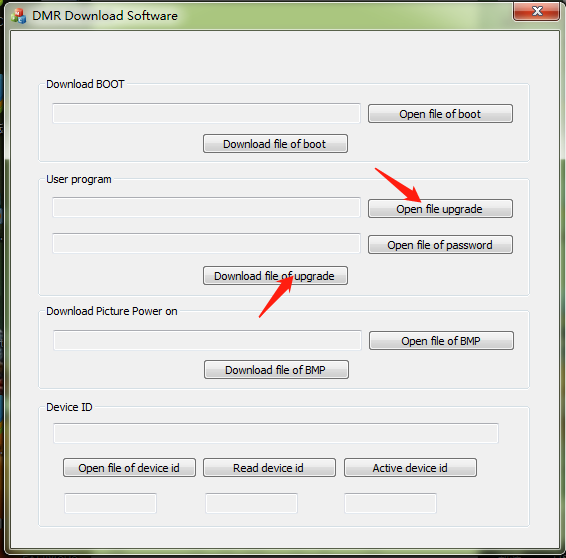

# TYT MD-UV380/390 firmware collection

This repo contains a collection of official firmware and cps for the TYT MD-UV380/390 radio in various variants that I was able to obtain.

If you have a version that is not shared here, please create a pull request.

## Docs

If you don't know which version of firmware or cps to use, check the documentation in [Docs](./Docs). 

## Firmware markings

V - non GPS version with 100k contacts\
D - non GPS version with 10k contacts and recording function\
P - GPS version with 100k contacts\
S - GPS version with 10k contacts and recording function

## How to flash 

Turn on the radio in download mode and connect cable. To do this, press PPT and the first side button and turn on the radio. The LED should flash green and red.

**Flashing the radio in normal mode will only destroy the firmware and the radio will not work properly.**

Run the program which you can find [here](./Flash%20tool/FirmwareDownloadV3.04_EN.exe).

In the **User program** section, press **Open file upgrade** and select the firmware file you want to load.

When you click **Download file of upgrade** button, the firmware loading process will begin.

After the upload is complete, disconnect the cable and reset the radio.

## AES settings in CPS

Not in all CPSes the option to configure AES, AES256 and ARC4 keys is visible by default.

To unlock it, go to **Privacy Settings** and use the **Ctrl-Shift-P** shortcut.

.png)

After restarting CPS, you will see the Universal tab where configuration options will be available.

.png)

